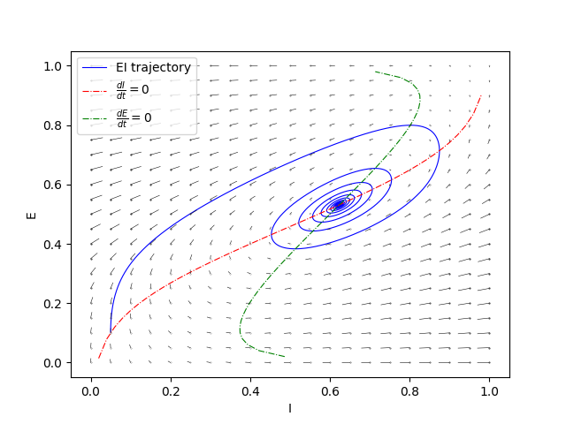
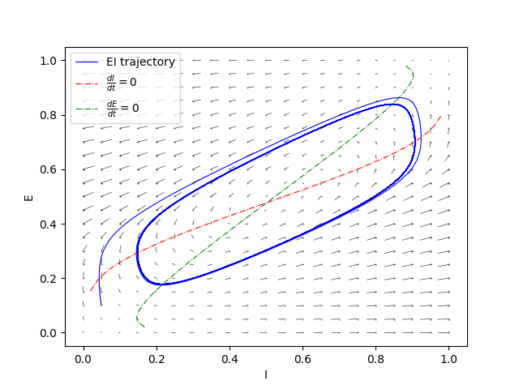
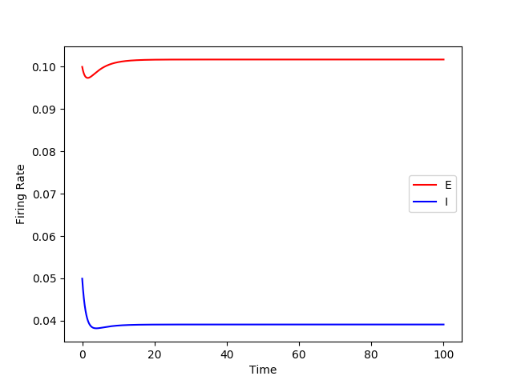

## Model Dynamics
This is a very basic analysis of the dynamics of the generated model with Python, where we
examine how different parameters alter the generated phase plane.

To generate the plots run: `run_WilsonCowan.sh`

The passed parameters are:
`-wee 10. -wei 12. -wie 8. -wii 3. -ze 0.2 -zi 4. -ie1 0 -ii1 0 -w 0.25`

  
  

`-wee 20. -wei 21. -wie 16. -wii 6 -ze 1.6 -zi 7. -ie1 0 -ii1 0 -w 0.25`

  
  

`-wee 10. -wei 9. -wie 5. -wii 3 -ze 3 -zi 4. -ie1 0 -ii1 0 -w 0.25`

  
  

