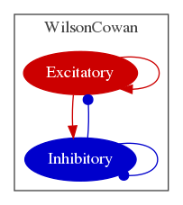

# Wilson and Cowan
From Excitatory and Inhibitory Interactions in Localized Populations of Model Neurons
Hugh R. Wilson and Jack D. Cowan; Biophys J. 1972 January; 12:1-24.

## Model

Implementations for this model are available in XPP, NEURON, Python and NeuroML.

### XPP
See [here](XPP).

## NEURON
See [here](NEURON).

   
   

## NeuroML

  
  

